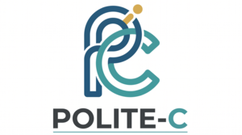
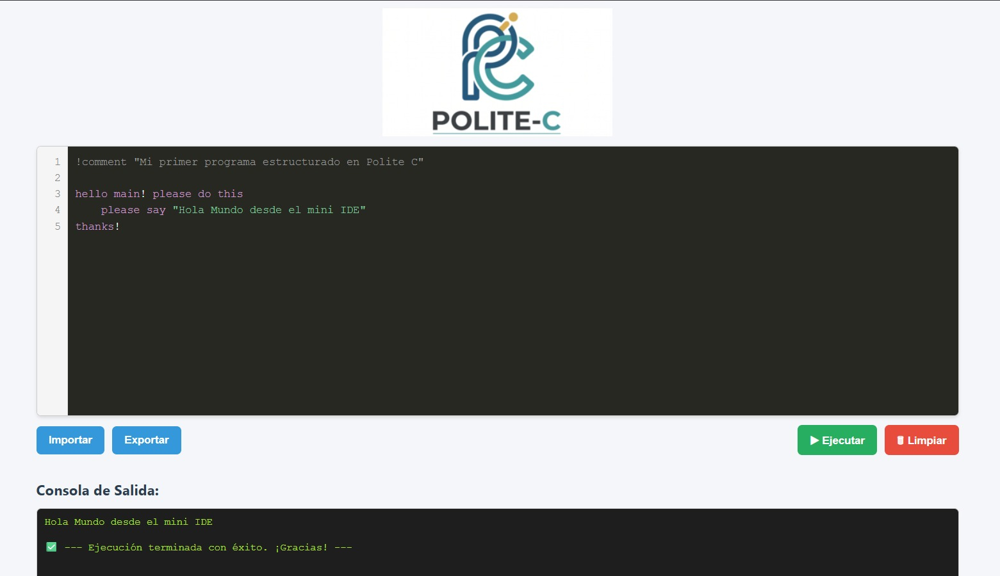
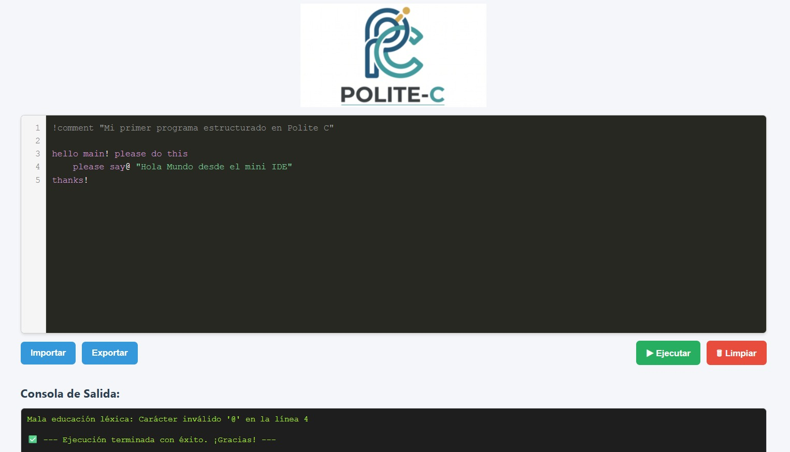
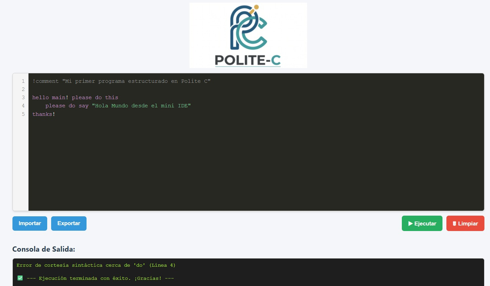

<p align="center">
  
</p>

<h1 align="center">Polite C Compiler</h1>

<p align="center">
  
  
  
  
</p>

<p align="center">
  <strong>Un mini-lenguaje orientado a objetos con sintaxis conversacional y educada.</strong>
  <br />
  Desarrollado para la cátedra de Teoría de la Computación — Universidad Nacional de Misiones.
</p>

---

**Polite C Compiler** es una aplicación web desarrollada con **Django** para analizar código escrito en **Polite C**, un mini-lenguaje de programación orientado a objetos con sintaxis conversacional.

El proyecto simula el funcionamiento básico de un compilador: el cliente envía una cadena de caracteres que representa el código fuente, y el servidor procesa esa entrada mediante un analizador léxico y un analizador sintáctico.

---

## Descripción del proyecto

**Polite C** es un mini-lenguaje diseñado con fines educativos. Su sintaxis está inspirada en lenguajes como **C** y **Java**, pero reemplaza parte de la simbología tradicional por expresiones más legibles y conversacionales.

El objetivo principal es facilitar la comprensión de conceptos relacionados con lenguajes formales, análisis léxico, análisis sintáctico y gramáticas libres de contexto.

---

## Ejemplo de código Polite C (Validador de Edad)

```c
hello main! please do this
    please define edad as number
    
    please say "Ingrese su edad por teclado: "
    please read edad
    
    if this happens (edad >= 18) please do this
        please say "El usuario es mayor de edad."
    if not please do this
        please say "El usuario es menor de edad."
    finish
thanks!
```

---

## Funcionalidades principales

- Recepción de código fuente Polite C desde el cliente.
- Procesamiento del código en el servidor.
- Identificación de tokens mediante un analizador léxico en `lexer.py`.
- Preparación para el análisis sintáctico mediante una gramática libre de contexto en `interpreter.py`.
- Separación del proyecto en módulos limpios dentro de una arquitectura Django.
- Interfaz web interactiva tipo mini IDE para pruebas en tiempo real.

---

## Funcionamiento e Interfaz (Demo)

El Mini IDE de Polite C cuenta con una interfaz web responsiva orientada a la educación, permitiendo analizar la estructura del lenguaje conversacional en tiempo real y devolviendo diagnósticos limpios desde el servidor.

### 1. Ejecución Exitosa (Caso Feliz)
Al introducir un código fuente semánticamente válido, el compilador procesa las cadenas a través de los pasillos de control y acepta la estructura formal.



### 2. Gestión de Errores Léxicos
Si el usuario introduce un carácter ilegal (como `@` o `$` que no pertenecen al alfabeto del lenguaje), la función de control léxico detiene el flujo e informa la anomalía de inmediato sin colapsar el sistema.



### 3. Gestión de Errores Sintácticos
Cuando el orden de los tokens rompe las reglas establecidas en la gramática libre de contexto (notación BNF), el algoritmo LALR(1) detecta el conflicto y reporta en qué token específico se perdió la coherencia de la oración.



---

## Tecnologías utilizadas

- Python
- Django
- PLY (Python Lex-Yacc)
- HTML
- CSS
- JavaScript

---

## Estructura Real del Proyecto

```txt
Polite-C/
│
└── polite-c/                  # Carpeta raíz del proyecto Django
    ├── config/
    │   ├── settings.py
    │   ├── urls.py
    │   ├── asgi.py
    │   └── wsgi.py
    │
    ├── compiler/
    │   ├── utils/             # Módulos de compilación basados en PLY
    │   │   ├── __init__.py
    │   │   ├── lexer.py       # Analizador Léxico (Tokens y Regex)
    │   │   └── interpreter.py # Analizador Sintáctico (Gramática BNF y Parser)
    │   │
    │   ├── views.py           # Orquestación de peticiones HTTP/JSON
    │   ├── urls.py            # Enrutamiento de la aplicación
    │   └── tests.py
    │
    ├── static/                # Recursos visuales del Mini IDE
    │   ├── logo.png
    │   └── icon.png
    │
    ├── templates/
    │   └── index.html         # Interfaz del editor web
    │
    ├── manage.py
    └── requirements.txt
```

---

## Instalación y ejecución

### 1. Clonar el repositorio e ingresar a la carpeta del proyecto
Es importante ingresar a la subcarpeta interna `polite-c`, ya que allí se encuentran el archivo de dependencias y el entorno ejecutable de Django.

```bash
git clone [https://github.com/HeikyuDev/Polite-C.git](https://github.com/HeikyuDev/Polite-C.git)
cd Polite-C/polite-c
```

### 2. Crear el entorno virtual

En Windows (PowerShell):
```bash
python -m venv venv
```

En Linux o macOS:
```bash
python3 -m venv venv
```

### 3. Activar el entorno virtual

En Windows (PowerShell):
```bash
.\venv\Scripts\Activate.ps1
```

En Windows (CMD):
```bash
venv\Scripts\activate
```

En Linux o macOS:
```bash
source venv/bin/activate
```

### 4. Instalar dependencias
Con el entorno virtual activado, instalá los paquetes requeridos (Django, PLY, etc.):
```bash
pip install -r requirements.txt
```

Si el archivo `requirements.txt` todavía no existe, se puede generar con:
```bash
pip freeze > requirements.txt
```

### 5. Ejecutar migraciones base
```bash
python manage.py migrate
```

### 6. Iniciar el servidor de desarrollo
```bash
python manage.py runserver
```

Luego abrir en el navegador: `http://127.0.0.1:8000/`

---

## Flujo general de funcionamiento

```txt
Cliente web (Mini IDE)
    ↓
Envía código fuente como cadena de caracteres mediante POST
    ↓
Servidor Django (Views)
    ↓
Analizador léxico (utils/lexer.py) -> Lista de tokens
    ↓
Analizador sintáctico (utils/interpreter.py) -> Construcción del AST
    ↓
Retorno de resultado semántico o traza limpia de error al usuario
```

---

## Objetivo académico

Este proyecto forma parte del desarrollo de un mini-lenguaje orientado a objetos para aplicar conceptos prácticos de **Teoría de la Computación**, abarcando:

- Definición y clasificación de tokens formales.
- Expresiones regulares aplicadas a cadenas de texto.
- Análisis léxico mediante autómatas finitos.
- Gramáticas libres de contexto y análisis sintáctico ascendente.

---

## Estado del proyecto

Proyecto funcional con servidor web integrado. Actualmente se soporta el procesamiento léxico completo y la resolución sintáctica de estructuras de control básicas y estructuras de objetos a través del motor PLY.

---

## Autores

**Grupo 04 - Teoría de la Computación**  
Universidad Nacional de Misiones
```